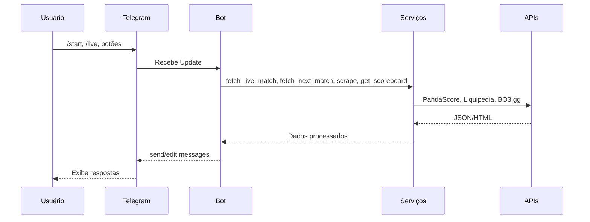
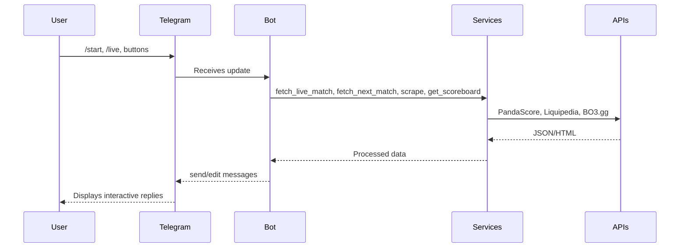

# 🚀 FURIA Telegram Bot

[](LICENSE)  [](https://www.python.org/)  [](https://telegram.org/)

---

## 🌐 Idiomas / Languages
- 🇧🇷 **Português**
- 🇺🇸 **English**

---

## 🇧🇷 Versão em Português

### 🎮 Descrição
**FURIA Telegram Bot** é um chatbot interativo para fãs de CS:GO da FURIA, desenvolvido no **Challenge #1: Experiência Conversacional**. Permite acompanhar partidas ao vivo, consultar resultados, estatísticas e interagir na comunidade.

### ✨ Funcionalidades
- 📱 **Menu Interativo**: Navegação por botões inline.
- 🔴 **Status de Partidas ao Vivo**: Atualizações automáticas via PandaScore API.
- ⏭️ **Próxima Partida**: Data, horário, adversário e liga.
- 🏆 **Último Resultado**: Evento, placar e desfecho obtidos do Liquipedia.
- 📊 **Estatísticas do Jogo**: MVP, kills, deaths, assists, ADR e pontuação.
- 📋 **Enquete de Torcida**: Vote no jogador que vai brilhar.
- 🔄 **Alternar Line**: Troca entre as equipes masculina e feminina.
- 🔗 **Menu de Redes Sociais**: Links oficiais das duas equipes.

### 🏗️ Arquitetura


> Os **serviços externos** utilizados são:
> - 🔹 **PandaScore**: status de partidas e estatísticas ao vivo (services `pandascore.py`, `live_status.py`)
> - 🔹 **Liquipedia**: scraping de resultados e informações de eventos (service `result_matcher.py`)
> - 🔹 **BO3.gg**: dados de confrontos e placares detalhados (service `last_scoreboard.py`)

### 🛠️ Tech Stack
- **Linguagem**: Python 3.9+
- **Framework**: python-telegram-bot v20+
- **HTTP**: httpx (async) & requests
- **Parsing HTML**: BeautifulSoup4
- **APIs**: PandaScore, Liquipedia
- **Env Management**: python-dotenv

### 📂 Estrutura do Projeto
```text
furia-telegram-bot/
├── bot.py                  # Bot entrypoint
├── handlers.py             # Command & callback handlers
├── markups.py              # InlineKeyboard definitions
├── services/               # External integrations
│   ├── pandascore.py       # Próxima partida via PandaScore API
│   ├── live_status.py      # Status de partidas ao vivo via PandaScore API
│   ├── last_scoreboard.py  # Scoreboard scraping via BO3.gg
│   ├── result_matcher.py   # Extração de dados do Liquipedia
│   └── roster_service.py   # Busca do roster atual
├── assets/                 # Logos e imagens
├── .env                    # Variáveis de ambiente
└── README.md               # Documentação
```

### ⚙️ Instalação
```bash
git clone https://github.com/seu-usuario/furia-telegram-bot.git
cd furia-telegram-bot
python3 -m venv .venv
# Linux/MacOS
source .venv/bin/activate
# Windows
.\.venv\Scripts\activate
pip install -r requirements.txt
cp .env.example .env
# Edite .env com BOT_TOKEN e PANDASCORE_TOKEN
```

### ▶️ Uso
```bash
python bot.py
```

**Principais Comandos**
| Comando     | Descrição                                         |
|-------------|---------------------------------------------------|
| `/start`    | Exibe menu principal                              |
| `/help`     | Mostra ajuda                                      |
| `/live`     | Inicia monitoramento de partidas ao vivo (a cada 45s) |
| `/stoplive` | Encerra monitoramento                             |

### 🚀 Roadmap (Futuras Melhorias)
- ⏰ Notificações pré-jogo (10 minutos antes)
- 🤖 Chatbot com IA para responder FAQs
- 📅 Agenda semanal de partidas com exportação de calendário
- 🌐 Suporte multilíngue (EN, ES, PT)
- 📈 Histórico de interações de fãs

### 🤝 Contribuição
1. Abra uma _issue_ para discutir ideias
2. Faça um fork e crie uma branch
3. Envie um Pull Request

### 📄 Licença
Este projeto está licenciado sob a licença MIT.

---

## 🇺🇸 English Version

### 🎮 Description
**FURIA Telegram Bot** is an interactive chatbot for CS:GO FURIA fans, built as part of **Challenge #1: Conversational Experience**. It lets users follow live matches, view results and stats, and engage with the community.

### ✨ Features
- 📱 **Interactive Menu**: Inline button navigation.
- 🔴 **Live Match Status**: Automatic updates via PandaScore API.
- ⏭️ **Next Match**: Date, time, opponent, and league info.
- 🏆 **Last Result**: Event, score, and outcome scraped from Liquipedia.
- 📊 **Match Statistics**: MVP, kills, deaths, assists, ADR, and score.
- 📋 **Fan Poll**: Vote for the player to watch.
- 🔄 **Line Toggle**: Switch between men’s and women’s rosters.
- 🔗 **Social Links**: Official channels.

### 🏗️ Architecture


> The **external services** used are:
> - 🔹 **PandaScore**: next match & live match status and stats (services `pandascore.py`, `live_status.py`)
> - 🔹 **Liquipedia**: scraping results and event data (service `result_matcher.py`)
> - 🔹 **BO3.gg**: match details and detailed scoreboard (service `last_scoreboard.py`)

### 🛠️ Tech Stack
- **Language**: Python 3.9+
- **Framework**: python-telegram-bot v20+
- **HTTP Clients**: httpx (async) & requests
- **HTML Parsing**: BeautifulSoup4
- **APIs**: PandaScore, Liquipedia
- **Environment**: python-dotenv

### 📂 Project Structure
```text
furia-telegram-bot/
├── bot.py                  # Bot entrypoint
├── handlers.py             # Command & callback handlers
├── markups.py              # InlineKeyboard definitions
├── services/               # External integrations
│   ├── pandascore.py       # Next match via PandaScore API
│   ├── live_status.py      # Live match status via PandaScore API
│   ├── last_scoreboard.py  # Scoreboard scraping via BO3.gg
│   ├── result_matcher.py   # Liquipedia data extraction
│   └── roster_service.py   # Current roster fetcher
├── assets/                 # Logos and images
├── .env                    # Environment variables
└── README.md               # Documentation
```

### ⚙️ Installation
```bash
git clone https://github.com/your-username/furia-telegram-bot.git
cd furia-telegram-bot
python3 -m venv .venv
# macOS/Linux
source .venv/bin/activate
# Windows
.\.venv\Scripts\activate
pip install -r requirements.txt
cp .env.example .env
# Set BOT_TOKEN and PANDASCORE_TOKEN in .env
```

### ▶️ Usage
```bash
python bot.py
```

**Main Commands**
| Command     | Description                                  |
|-------------|----------------------------------------------|
| `/start`    | Opens main menu                              |
| `/help`     | Shows help                                   |
| `/live`     | Starts live monitoring (45s interval)        |
| `/stoplive` | Stops live monitoring                        |

### 🚀 Roadmap (Future Improvements)
- ⏰ Pre-game notifications (10 minutes before)
- 🤖 AI chatbot for FAQs
- 📅 Weekly schedule with calendar export
- 🌐 Multilingual support (EN, ES, PT)
- 📈 Fan interaction history

### 🤝 Contributing
1. Open an issue to discuss ideas
2. Fork and create a branch
3. Submit a Pull Request

### 📄 License
This project is licensed under the MIT License.  © 2025 FURIA Esports